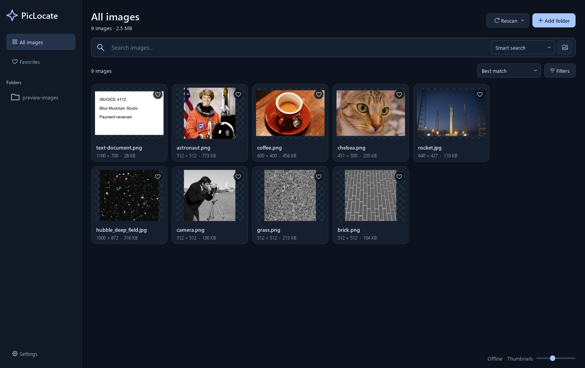

# PicLocate

Search images by description, filename or visual similarity. C++20 and Qt Widgets; local processing, no account or API key, optional GPU.



## Use

On Windows, run setup or open `PicLocate.exe` from the portable folder. Keep the accompanying files together. Models are bundled; upgrades and uninstall preserve your library.

1. **Add folder** to index images and subfolders. **Rescan** updates or resumes indexing.
2. Use **Smart search** for descriptions, **Visual only** for image content or **Text only** for filenames, OCR and saved descriptions.
3. Select **Find similar subjects** or **Match appearance**, or drop a reference image. Appearance modes match overall appearance, shape or palette.
4. Scroll for more results. Favorite images, edit descriptions or double-click to open the viewer.

**Filters** controls shape/format; **Thumbnails** changes card size. `Ctrl+K` focuses search. In the viewer, scroll to zoom, drag to pan, arrows to navigate, `0` to fit and `Esc` to close.

Text search accepts phrases (`"red sword"`) and prefixes (`sword*`). **Rescan → Build appearance index (fast)** upgrades existing libraries without AI inference. Settings downloads missing models.

Supports JPEG, PNG, WebP, GIF, TIFF, BMP and SVG; indexes the first frame/page. English descriptions work best. Semantic search can miss fine details; generated labels are suggestions.

## Build

Requires CMake 3.24+, Ninja and a C++20 compiler. See [platform prerequisites and support limits](docs/compatibility.md).

```powershell
# Windows: Visual Studio C++ tools
./scripts/build.ps1
```

```sh
# macOS/Linux
bash scripts/build.sh
```

Scripts build, test and package into `dist/`. CPM caches pinned dependencies/models outside the repository. See [packaging](docs/installer.md).

## Releases

GitHub Actions builds six Windows/macOS/Linux targets. A version bump on `main` publishes after all checks pass. Release builds check daily; **Settings → Updates** verifies downloads and installs updates. Checks are optional. See [release setup](docs/installer.md#releases-and-updates).

[Contributing](CONTRIBUTING.md) · [Architecture and CLI](docs/architecture.md) · [Changelog](CHANGELOG.md) · [Privacy](PRIVACY.md)

Code: [MIT](LICENSE). Packages include dependency licenses and matching Qt sources; see [third-party notices](THIRD_PARTY.md).
